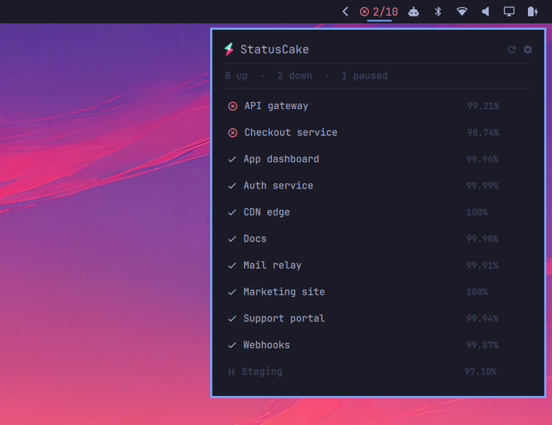

# StatusCake for Omarchy

An [Omarchy](https://omarchy.org/) shell bar widget showing the status of your
[StatusCake](https://www.statuscake.com/) uptime checks.

The widget contains a panel listing every check, each with its
uptime percentage.



## Install

```bash
omarchy plugin add https://github.com/robinvanderknaap/omarchy-statuscake.git --enable
```
Create a token at [app.statuscake.com](https://app.statuscake.com/User/Account). The widget only needs read access to uptime tests.

Set your API token by clicking the widget in the bar. Paste the token and press Enter.

The token is verified against the API before anything is saved; then the token is stored in your keyring.

There is a terminal path too, which does the same thing:

```bash
~/.config/omarchy/plugins/robinvanderknaap.statuscake/bin/statuscake-setup
```

If the widget does not appear, place it explicitly:

```bash
omarchy bar move robinvanderknaap.statuscake --section right
```

## Interactions

| | |
|---|---|
| Left click | list uptime checks, services that are down are listed first |
| Middle click | force a refresh |
| Right click | open app.statuscake.com in your browser |
| Cog in the panel | open settings |
| `Esc` | leave settings, or close the panel when the check list is up |

## Settings

Everything is set behind the cog in the panel, and every control writes on the
spot, so there is nothing to save.

| Key | Default | Meaning |
|---|---|---|
| `refreshIntervalSec` | `300` | How often to poll. Clamped to 60–3600. |
| `tags` | `""` | Comma-separated list of tags; only matching uptime checks are counted. |
| `matchAnyTag` | `true` | Match uptime checks carrying *any* of `tags` rather than all of them. |
| `notify` | `true` | Desktop notification when a check flips up→down or back. |

### Tags

Tags are picked from the ones your account actually uses rather than typed:
the control lists every distinct tag on your checks, with a search box for
narrowing a long list and a checkbox per tag. That list comes from an
unfiltered fetch each time the picker opens, so a tag you just added in
StatusCake is one refresh button away.

### Notifications

Notifications fire only on a *change*, and only for checks seen in both the
previous and current poll. A shell restart never replays a backlog, pausing a
down check is not a recovery, and twenty checks failing at once is one
notification rather than twenty.

## API token

The API token set in the settings panel is stored in your keyring. The token is never written to `shell.json`, never passed as a command-line argument, and never echoed. 

The token is read at refresh time from, in order:

1. `$STATUSCAKE_API_TOKEN`
2. your keyring (`secret-tool lookup service statuscake account api`)
3. `~/.config/omarchy/statuscake-token`, if it exists (mode 0600)

That order is worth knowing if you set the environment variable: it wins over
what the panel saves in the keyring.

`bin/statuscake-setup --status` reports where a token was found and whether it
still works (`--no-verify` skips the API call); `--remove` deletes it. Add
`--json` to any of them for one machine-readable object — that is how the panel
talks to it.

### Removing API token

Removing the plugin does not remove the token. Omarchy has no uninstall hook —
`omarchy plugin remove` deletes the folder and stops — so the credential would
otherwise sit in your keyring after the widget that used it is gone.

Delete it first, from the settings view: **Remove token** in the API token
section. Then remove the plugin:

```bash
omarchy plugin remove robinvanderknaap.statuscake
```

If the plugin is already gone, the entry is a plain keyring item and
`secret-tool` clears it without any of this plugin's files:

```bash
secret-tool clear service statuscake account api
rm -f ~/.config/omarchy/statuscake-token
```

Revoking the token at
[app.statuscake.com](https://app.statuscake.com/User/Account) is the thorough
version, and the only one that matters if the token ever left this machine.

## Development

```bash
test/run.sh
```

Runs manifest validation, the `Model.js` unit tests, and the shell helpers
against a mock API. No network access and no StatusCake account required —
which is the point, since the states that matter most (checks down, transitions
between polls, API errors, a token the API refuses) never occur on a healthy
account. Nothing in the suite touches your real keyring, token file or account.

All decisions live in `Model.js` as pure functions; the QML files hold only Qt
objects and wiring. That is what makes the down path testable without waiting
for a real outage.

### Notes for anyone writing an Omarchy bar widget

Five things cost real debugging time here. The first two contradict
`shell/plugins/bar/README.md` as shipped with Omarchy 4.0.0; the rest it is
silent on:

- **A plain `MouseArea` does not receive left clicks.** The bar covers every
  widget slot with its own MouseArea to drive drag-to-reorder. It dispatches a
  real click by calling `triggerPress(button)` on the widget root, and
  `Bar.moduleTargetClickable()` tests for exactly that function — without it the
  widget is not clickable and gets no pointing-hand cursor. Right and middle
  clicks *do* reach your own MouseArea, since the bar accepts left only.
- **`bar.shellQuote()` does not exist.** Use `Util.shellQuote()` from
  `qs.Commons`. Calling the documented name throws at runtime.
- **`omarchy-shell shell rescanPlugins` does not rebuild a mounted bar widget.**
  It logs `Local plugin changed, reloading` and leaves the running instance
  alone, so you keep testing stale code. Use `omarchy restart shell`.
- **A text field in a `PopupCard` never receives a keystroke.** `PopupCard` is
  an xdg-popup on the bar's layer surface, and the bar never asks for keyboard
  focus — its `BarPanel` sets no `keyboardFocus` at all, which layer-shell
  reads as `None` — so focus is never routed into the popup and the field takes
  the caret and then receives nothing. Only a layer surface that
  asks for keyboard focus can be typed into, and `qs.Ui`'s `KeyboardPanel` is
  the drop-in answer: it primes `WlrKeyboardFocus.Exclusive` briefly and then
  settles on `OnDemand`.
- **Never hold `WlrKeyboardFocus.Exclusive` for as long as a surface is up.**
  Hyprland then routes every pointer event to that surface whatever output the
  cursor is over, and no other window can be clicked. A layer surface is also
  not a toplevel, so `SUPER+W` cannot close it and closes whatever real window
  is behind it instead — which is what a centered modal invites the user to
  try. Both are why settings here live in the panel rather than a window of
  their own.

## License

MIT — except `assets/statuscake.svg`, which is StatusCake's mark, cropped from
[their own horizontal logo](https://static.statuscake.com/img/logos/horizontal-logo-blackberry-text.svg)
and used to identify the service this widget talks to. It is their trademark, not
mine to relicense, and it is not covered by the MIT grant above.
